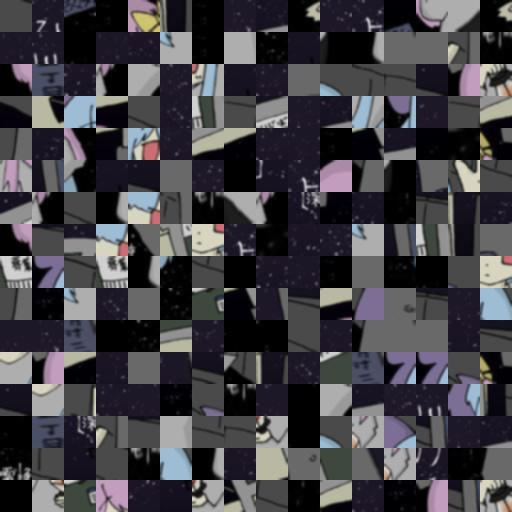

# FluentPlayerBG
Generate fluent, aesthetic backgrounds from album covers — lightweight, cacheable, and perfect for wearables and music apps.<br>
以低性能创建适用于音乐播放器的背景图像，具有轻量，可缓存的特点。可适用于可穿戴设备或者其它音乐app。

# How to use 【使用方法】
1.Use pip to install the required dependencies.<br>
使用pip安装所需要的依赖
```powershell
pip install mutagen opencv-python pillow numpy
```

2.Enter the path of the mp3 or flac file. Be sure to use an absolute path.<br>
输入mp3或者flac文件的路径,注意使用绝对路径。
```powershell
PS D:\> python .\main.py
请输入mp3文件或flac文件路径：D:\test.mp3
```

3.The final result `merged_image.jpg` and the `output` folder will be generated in the same directory as the Python script, while the extracted album cover will be saved in the same directory as the original music file.<br>
将会在与py脚本同目录下生成最终的结果`merged_image.jpg`和`output`文件夹，同时在音乐文件同目录生成提取后的专辑封面文件。
```powershell
PS D:\> python .\main.py
请输入mp3文件或flac文件路径：test.flac
file_extension=".flac"
封面图片已提取，并保存为：test.jpg
处理完成！
```
# Usage Notes 【注意事项】
1.This is a demonstration program that only showcases the core processing logic. You need to handle exceptions and edge cases yourself.<br>
这只是个演示程序，只展示处理的逻辑。需要自行处理异常情况。<br>
2.Please comply with the open source license terms.<br>
请遵守开放源代码使用协议。

# DEMO 
The following images are for demonstration purposes only and are **not included in the code repository or license**. All rights to the album artwork belong to the original artist.<br>
以下示例图片仅用于演示，不包含在代码仓库及其许可证中。专辑封面版权归原作者所有。

<table>
  <tr>
    <td></td>
    <td>
      <b>Cover of Album:</b> <br>電ǂ鯨 - よるりり (深夜盤)<br>
    </td>
  </tr>
  <tr>
    <td></td>
    <td>
      <code>ImageFilter.GaussianBlur(radius=0)</code><br>
    </td>
  </tr>
  <tr>
    <td></td>
    <td>
      <code>ImageFilter.GaussianBlur(radius=30)</code><br>
    </td>
  </tr>
  <tr>
    <td></td>
    <td>
      <code>ImageFilter.GaussianBlur(radius=40)</code><br>
    </td>
  </tr>
</table>
